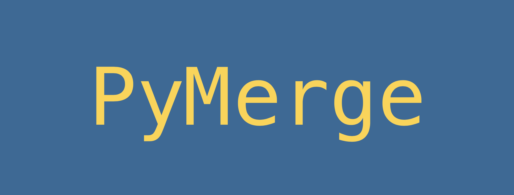

## PyMerge is a diff/merge utility written in Python, enabling seamless, cross-platform use.

### Installation
#### System Requirements:
Although PyMerge should run on most machines with Python 3.7+ installed, for best performance your computer should have
the specifications listed below:

* Minimum recommended machine specifications:
    * Dual core processor, 2.5GHz
    * 2GB Ram
    * [Python 3.7+](https://www.python.org/downloads/)
    * OS:
        * Windows 7 or later
        * macOS 10.9 or later
        * Linux
#### Option 1: Installer:
Download the appropriate installer for PyMerge.

| OS            | Architecture| Installer     |
| :---          |    :----:   |          :--- |
| **Windows**   | x64         | [PyMerge-1.0-windows-x64-installer.exe]()   |
| **Windows**   | x86         | [PyMerge-1.0-windows-installer.exe]()       |
| **macOS**     | --          | [PyMerge-1.0-osx-installer]()               |
| **Linux**     | x64         | [PyMerge-1.0-linux-x64-installer.run]()     |
| **Linux**     | x86         | [PyMerge-1.0-linux-installer.run]()         |

#### Option 2: Clone the repository
You may optionally clone the repository and just run PyMerge.py directly (this is the more 
portable way of doing things) from your command line. 
### Use
##### Command line usage:
In your terminal, type 
~~~~~
python3 PyMerge.py <file1> <file2>
~~~~~
Where \<file1\> is the file you would like to appear on the left-hand side of the comparison window and
\<file2\> is the file you would like to appear on the right-hand side.
This will start the application and load the comparison table for the two files passed as arguments.

Alternatively, you may start the application without any arguments and add them later:
~~~~~
python3 PyMerge.py
~~~~~

#### Running with invocation script/executable:
Each installation includes a script or executable meant to invoke the main program. For macOS and Linux this 
will be a bash file (.sh) or a binary. For Windows this will be a batch file (.bat) or a binary. Double clicking
these files will run the main PyMerge application. No files will be loaded this way, so you must select the 
file you would like to compare after the program initializes. 

### Acknowledgements
#### Icons
* add.png: 
* down-arrow.png:
* up-arrow.png:
* left-arrow.png: 
* right-arrow.png:
* undo-arrow.png:
* redo-arrow.png:

#### Installer builder:
* BitRock InstallBuilder Enterprise 19.8.0 \
